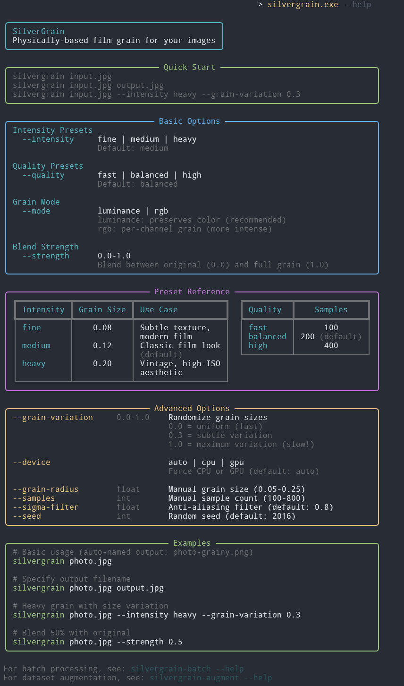
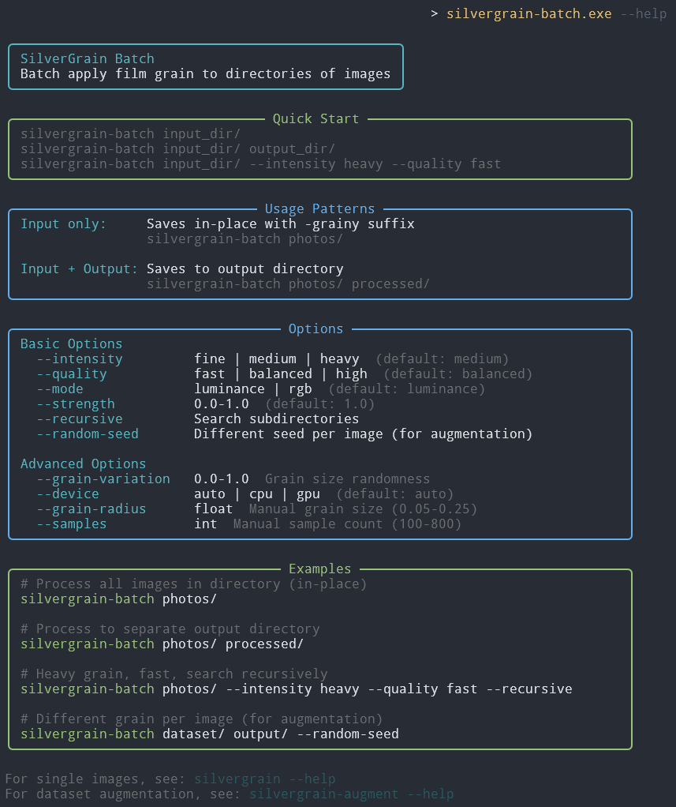

# SilverGrain

Physically-based film grain rendering for Python.

SilverGrain implements the photographic grain simulation algorithm from [Newson et al. (2017)](https://doi.org/10.5201/ipol.2017.192), making it accessible as a friendly Python library and CLI tool. Unlike simple noise overlays, this approach models grain as a stochastic geometric process based on the actual physics of silver halide crystals in analog film.

The result: realistic, resolution-independent grain that scales cleanly to any output size.

### Example
| Original                               | SilverGrain (luminance)                              |
|----------------------------------------|------------------------------------------------------|
|  |  |


## Features

- **Physically accurate**: Models grain using Poisson point processes and Boolean geometry, matching how real film works
- **Resolution independent**: Render at any zoom level—grain structure remains consistent
- **GPU accelerated**: CUDA support for ~750× speedup on typical workloads
- **Flexible processing**: Apply grain to luminance only (preserves color) or per-channel (chromatic grain)
- **Multiple interfaces**: Use as a Python library, single-image CLI, batch processor, or dataset augmentation tool
- **Adjustable strength**: Blend grain with original image for subtle effects

## Installation

```bash
# RECOMMENDED: With GPU acceleration (requires NVIDIA GPU + CUDA)
pip install silvergrain[gpu]

# CPU-only version (deathly slow, you have been warned)
pip install silvergrain
```

## Quick Start

### Command Line

Process a single image:
```bash
silvergrain input.png output.png --grain-radius 0.12
```

Batch process a directory:
```bash
silvergrain-batch images/ processed/ --grain-radius 0.15 --strength 0.8
```

Generate augmented variants:
```bash
silvergrain-augment clean_images/ augmented/ \
    --count 10 \
    --grain-radius 0.08:0.20 \
    --strength 0.7:1.0
```

### Python Library

```python
from PIL import Image
from silvergrain import FilmGrainRenderer

# Load image
image = Image.open("input.png")

# Create renderer with desired grain characteristics
renderer = FilmGrainRenderer(
    grain_radius=0.12,      # Average grain size (smaller = finer grain)
    n_monte_carlo=200,      # Quality vs speed tradeoff
    device='auto'           # Use GPU if available
)

# Apply grain
output = renderer.process_image(image, mode='luminance', strength=1.0)
output.save("output.png")
```

## How It Works

Traditional "film grain" effects just overlay noise patterns as gaussian, color, or luminance noise. SilverGrain does something more interesting: it simulates the actual stochastic geometry of photographic film grain.

### The Physical Model

In real photographic film, light-sensitive silver halide crystals are randomly distributed across the emulsion. When exposed and developed, each crystal that absorbed a photon becomes an opaque grain. The key insight: darker regions have *higher grain density*, not larger grains.

SilverGrain models this using:
1. **Poisson point process**: Grain centers placed randomly with density proportional to pixel brightness
2. **Boolean model**: Each grain is a disk with random radius (optional log-normal distribution)
3. **Monte Carlo convolution**: Simulate the optical filtering of the film-to-print process

This produces grain that:
- Scales correctly across brightness levels (more grain in shadows, less in highlights)
- Remains consistent when zooming or changing resolution
- Exhibits the characteristic "clumpy" structure of real film

### The Practical Implementation

The Monte Carlo approach works by:
1. For each output pixel, take N random samples from a Gaussian-offset neighborhood
2. For each sample, determine if it's covered by a grain (using deterministic per-pixel RNG)
3. Average the results to get the filtered grain value

This is parallel—perfect for GPU acceleration. The CUDA implementation typically runs 500x faster than CPU for typical images.

## Usage Patterns

### CLI Tools

| `silvergrain` | `silvergrain-batch` |
|:---:|:---:|
|  |  |

#### `silvergrain` - Single Image Processing

Apply grain to one image with full control over parameters:

```bash
silvergrain input.png output.png \
    --grain-radius 0.15 \
    --grain-sigma 0.03 \
    --n-monte-carlo 400 \
    --mode luminance \
    --strength 0.9
```

**Key options:**
- `--grain-radius`: Mean grain size in pixels (0.05-0.3 typical)
- `--grain-sigma`: Grain size variation (0 = uniform, higher = more variation)
- `--sigma-filter`: Anti-aliasing strength (default 0.8)
- `--n-monte-carlo`: Sample count (higher = better quality, slower)
- `--mode`: `luminance` (color-preserving) or `rgb` (per-channel)
- `--strength`: Blend amount 0.0-1.0 (1.0 = full grain)
- `--quality`: Quick preset (`fast`, `balanced`, `high`)

#### `silvergrain-batch` - Batch Processing

Process multiple images with consistent settings:

```bash
# Process entire directory
silvergrain-batch images/ output/ --quality high

# In-place processing with suffix
silvergrain-batch images/ --grain-radius 0.12

# Recursive search
silvergrain-batch images/ output/ --recursive --strength 0.7
```

**Key options:**
- Output directory is optional—omit for in-place mode (adds `-grainy.png` suffix)
- `--recursive`: Search subdirectories
- `--simple`: Minimal progress output

#### `silvergrain-augment` - Dataset Augmentation

Generate randomized variants for training data augmentation:

```bash
silvergrain-augment clean_images/ augmented/ \
    --count 20 \
    --grain-radius 0.08:0.20 \
    --strength 0.7:1.0 \
    --mode rand
```

**Key features:**
- Parameter ranges: Use `low:high` syntax for random sampling per variant
- Fixed values: Use single numbers for consistent parameters
- Output structure: Creates `aug_0/`, `aug_1/`, etc. with preserved filenames (perfect for paired dataloaders)
- `--mode rand`: Randomly chooses `luminance` or `rgb` per variant

**Example output structure:**
```
augmented/
├── aug_0/
│   ├── image_001.png
│   └── image_002.png
├── aug_1/
│   ├── image_001.png
│   └── image_002.png
...
```

### Library Usage

#### Basic Rendering

```python
from PIL import Image
from silvergrain import FilmGrainRenderer

renderer = FilmGrainRenderer(grain_radius=0.12, n_monte_carlo=200)
image = Image.open("input.png")
output = renderer.render(image)  # Full grain, same resolution
output.save("output.png")
```

#### Luminance vs RGB Modes

```python
# Luminance mode: grain only affects brightness, preserves color
output = renderer.process_image(image, mode='luminance')

# RGB mode: independent grain per channel, can shift colors
output = renderer.process_image(image, mode='rgb')
```

#### Strength Blending

```python
# Subtle grain at 50% strength
output = renderer.process_image(image, strength=0.5)
```

#### GPU Acceleration

```python
# Explicit GPU (raises error if unavailable)
renderer = FilmGrainRenderer(device='gpu', grain_radius=0.12)

# Auto-detect (uses GPU if available, CPU otherwise)
renderer = FilmGrainRenderer(device='auto', grain_radius=0.12)

# Check which device is being used
print(renderer.device)  # 'cpu' or 'gpu'
```

#### Zoom and Resolution Control

```python
# Double the output resolution
output = renderer.render(image, zoom=2.0)

# Explicit output size
output = renderer.render(image, output_size=(1920, 1080))
```

#### Quality Presets

```python
# Fast preview
renderer = FilmGrainRenderer(grain_radius=0.12, n_monte_carlo=100)

# Balanced (default)
renderer = FilmGrainRenderer(grain_radius=0.12, n_monte_carlo=200)

# High quality
renderer = FilmGrainRenderer(grain_radius=0.12, n_monte_carlo=400)
```

## Parameter Guide

### `grain_radius` (float, default 0.1)

Average grain radius in pixels. This is the most important parameter for controlling grain appearance.

- **0.05-0.08**: Very fine grain (ISO 100-200 equivalent)
- **0.10-0.15**: Medium grain (ISO 400-800)
- **0.20-0.30**: Heavy grain (ISO 1600-3200)

Smaller values = finer, more subtle grain. Larger = coarser, more visible texture.

### `grain_sigma` (float, default 0.0)

Standard deviation of grain size distribution (log-normal). Controls grain size variation.

- **0.0**: All grains same size (uniform, can look artificial)
- **0.02-0.05**: Subtle variation (realistic)
- **0.1+**: High variation (artistic effect)

Small variation often looks more natural than perfectly uniform grain.

### `sigma_filter` (float, default 0.8)

Gaussian filter strength for anti-aliasing. Simulates the optical blur of projection/viewing.

- **0.5-0.7**: Sharper grain (more texture)
- **0.8-1.0**: Smoother grain (more subtle)
- **1.2+**: Very smooth (soft focus effect)

### `n_monte_carlo` (int, default 800)

Number of samples per pixel. Higher = better quality but slower.

- **100-150**: Fast preview
- **200-300**: Balanced quality/speed
- **400-800**: High quality
- **1000+**: Diminishing returns (mostly overkill)

Quality scales roughly as √N, so doubling sample count gives ~40% quality improvement.

### `device` (str, default 'auto')

- **'auto'**: Use GPU if available, fall back to CPU
- **'cpu'**: Force CPU rendering (always available)
- **'gpu'**: Force GPU rendering (errors if unavailable)

### `mode` (str, default 'luminance')

- **'luminance'**: Apply grain only to brightness channel (preserves colors, more realistic for color film)
- **'rgb'**: Apply independent grain to R, G, B channels (can shift colors, more film-like color artifacts)

### `strength` (float, default 1.0)

Blend factor between original and grained image.

- **0.0**: Original image, no grain
- **0.5**: 50/50 blend
- **1.0**: Full grain effect

## Performance

Benchmark results (1024×1024 gradient, n_monte_carlo=200):

- **CPU**: ~159 seconds (2.6 minutes)
- **GPU (CUDA)**: ~0.21 seconds

**GPU acceleration: ~750× speedup.**

The GPU advantage scales dramatically with:
- Image size (CPU time scales quadratically, GPU stays fast)
- Monte Carlo sample count (more samples = bigger CPU penalty)
- Batch processing (GPU overhead amortizes across images)

## Examples

See `examples/` directory for complete working examples:

- `example_01_basic_grain.py` - Default settings
- `example_02_fine_grain.py` - Subtle, fine grain
- `example_03_heavy_grain.py` - Coarse, heavy grain
- `example_04_luminance_mode.py` - Color-preserving grain
- `example_05_rgb_mode.py` - Per-channel grain
- `example_06_blended_strength.py` - Partial grain blending
- `example_07_gpu_accelerated.py` - GPU rendering

## Technical Background

SilverGrain implements the algorithm described in:

> Alasdair Newson, Julie Delon, and Bruno Galerne. "Realistic Film Grain Rendering."
> *Image Processing On Line*, 7:165–183, 2017.
> https://doi.org/10.5201/ipol.2017.192

The original paper provides a C++ reference implementation. SilverGrain reimplements the ideas directly from the paper in Python with:
- Modern NumPy/Numba architecture
- Optional GPU acceleration via CUDA
- Simplified API for common use cases
- CLI tools for practical workflows

### Key Differences from the Paper

1. **Algorithm selection**: The paper describes both grain-wise and pixel-wise algorithms with automatic selection. SilverGrain currently implements only the pixel-wise approach, which provides good performance across all grain sizes and parallelizes efficiently on GPU.

2. **Default parameters**: Higher default sample counts (n_monte_carlo=800 vs paper's lower values) since GPU acceleration makes this practical.

3. **Color processing**: An explicit `mode` parameter for luminance-only vs per-channel grain.

4. **Blending**: A `strength` parameter for partial grain effects, not in original paper.

## Why Not Just Use Noise?

Simple approaches like adding Gaussian noise or overlaying pre-made grain textures have several problems:

1. **Wrong brightness relationship**: Real grain density increases with exposure (darker = more grain), but noise is uniform
2. **Resolution dependence**: Noise patterns don't scale correctly when resizing
3. **Statistical properties**: Real grain has spatial correlations (clumping) that random noise lacks
4. **Physical implausibility**: Noise distributions don't match actual photographic processes

SilverGrain's physics-based approach produces grain that:
- Scales correctly across brightness levels
- Remains consistent at any resolution
- Exhibits realistic spatial structure
- Matches actual photographic characteristics

## License

[AGPLv3](https://en.wikipedia.org/wiki/GNU_Affero_General_Public_License) - see [LICENSE](./LICENSE) file for details.

## Citation

If you use SilverGrain in research, please cite the original paper:

```bibtex
@article{newson2017realistic,
  title={Realistic Film Grain Rendering},
  author={Newson, Alasdair and Delon, Julie and Galerne, Bruno},
  journal={Image Processing On Line},
  volume={7},
  pages={165--183},
  year={2017},
  doi={10.5201/ipol.2017.192}
}
```
